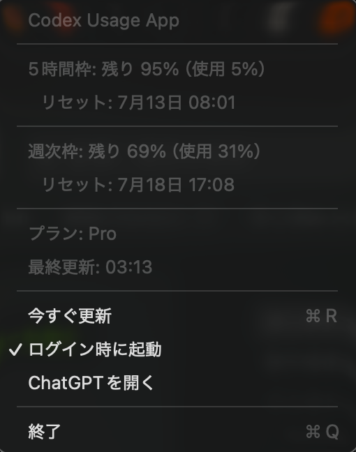

# Codex Usage App

<p align="center">
  
</p>

Codexのトータル枠の残量、今日の消費量、直近1時間の消費量をmacOSのメニューバーへ
表示する、非公式のオープンソースアプリです。5時間枠が返る場合は、その残量も
表示します。

[English README](README.md)

<p align="center">
  <a href="https://github.com/estay-inc/codex-usage-app/releases/latest/download/Codex-Usage-App.dmg"><strong>macOS版をダウンロード（DMG）</strong></a>
</p>

## 機能

- メニューバーにトータル枠の残量（`T`）、今日の消費量（`1D`）、直近1時間の
  消費量（`1H`）を表示
- 現在のペースでリセット前にトータル枠を使い切る見込みかどうかを、`1D`と
  `1H`の色で表示
- 5時間枠が取得できる場合のみ、その残量（`5h`）も表示
- 使用率、リセット日時、契約プラン、最終更新時刻を表示
- 2分ごとに自動更新
- macOS標準の`SMAppService`によるログイン時起動
- macOSの言語設定に合わせて日本語・英語の表示を自動切り替え
- 最大48時間のUsage履歴だけをMac内に保存し、外部へ送信しない

## 動作画面

<p align="center">
  
</p>

- `T 82%`は、トータル枠が82%残っていることを示します。
- `1D 6%`は、Macの現地時刻で今日0時からトータル枠を6%使用したことを示します。
- `1H 2%`は、直近1時間でトータル枠を2%使用したことを示します。
- `1D`と`1H`のパーセントは、表示値をそれぞれ1日・1時間あたりの消費量として
  リセット日時まで延長します。予測消費が現在の`T`残量以上なら赤、残量未満
  なら緑で表示します。
- リセット日時または計測値を取得できない場合は通常色です。`1D`に`+`が付く
  場合は、確認できた下限値だけで判定するため、緑でも枯渇しないことを保証する
  ものではありません。
- 0時の基準値がない場合は`1D 0%+`から計測を始め、確認できた使用量を
  `1D 3%+`のように表示します。`+`は「実際の使用量はこの値以上」を示します。
- 0時の基準値などから今日全体を確定できる場合は、`+`のない通常の`1D`へ
  自動的に切り替わります。
- 最初の1時間は`1H …`と表示します。
- 通常は`T 82%  1D 6%  1H 2%`、5時間枠も取得できる場合は
  `5h 70%  T 82%  1D 6%  1H 2%`のように表示します。
- 表示をクリックすると、使用率、リセット日時、契約プラン、最終更新時刻を
  確認できます。

## 動作条件

- macOS 13以降
- Apple SiliconまたはIntel Mac
- 以下のいずれかがインストールされ、ログイン済みであること
  - ChatGPT/Codexデスクトップアプリ
  - Codex CLI

このアプリはローカルの[Codex App Server](https://learn.chatgpt.com/docs/app-server)
を起動し、公式仕様の`account/rateLimits/read`を呼び出します。ChatGPTの
トークンを直接読み取ったり保存したりすることはありません。

## リリース版のインストール

1. [Codex-Usage-App.dmg](https://github.com/estay-inc/codex-usage-app/releases/latest/download/Codex-Usage-App.dmg)をダウンロードして開きます。
2. DMGを開き、その中の`Codex Usage.app`を開きます。
3. 「Applicationsフォルダへ移動しますか？」の画面で「移動して開く」を
   クリックします。
4. macOSにブロックされた場合は、FinderでControlキーを押しながらアプリを
   クリックし、「開く」を一度選択してください。
5. 必要に応じて、メニューから「ログイン時に起動」を有効にします。

コミュニティ向けリリースはAd Hoc署名であり、Appleの公証は受けていません。

## ソースからビルド

Xcode本体は必須ではありません。Xcode Command Line ToolsのSwiftツール
チェーンでビルドできます。

```bash
git clone https://github.com/estay-inc/codex-usage-app.git
cd codex-usage-app
./scripts/build.sh
open "build/Codex Usage.app"
```

Universal BinaryとZIPを作成する場合：

```bash
ARCHS=universal PACKAGE=1 ./scripts/build.sh
```

GitHub Releases用のDMGを作成する場合：

```bash
ARCHS=universal DMG=1 ./scripts/build.sh
```

Codexへログイン済みのMacで実データ取得までテストする場合：

```bash
CODEX_USAGE_LIVE_TEST=1 ./scripts/test.sh
```

Codexが独自の場所にある場合は、起動前に`CODEX_PATH`へ実行ファイルの絶対
パスを指定してください。

## プライバシー

詳細は[PRIVACY.md](PRIVACY.md)を参照してください。今日と直近1時間の消費量を
計算するため、最大48時間の時刻と使用率だけをmacOSの`UserDefaults`へ保存します。
アプリが起動するCodex App Serverは、利用者の既存アカウントとOpenAIの規約に
基づいてOpenAIと通信します。

## ライセンスと商標

ソースコードは[MIT License](LICENSE)で公開します。

本プロジェクトは非公式であり、OpenAIによる提供、承認、後援を受けていません。
Codex、ChatGPT、OpenAIおよび関連する名称はOpenAIの商標です。OpenAIのロゴや
OpenAI製ソフトウェアを本リポジトリへ同梱していません。
Codex本体はOpenAIから別途[Apache-2.0 License](https://github.com/openai/codex)
で公開されています。
