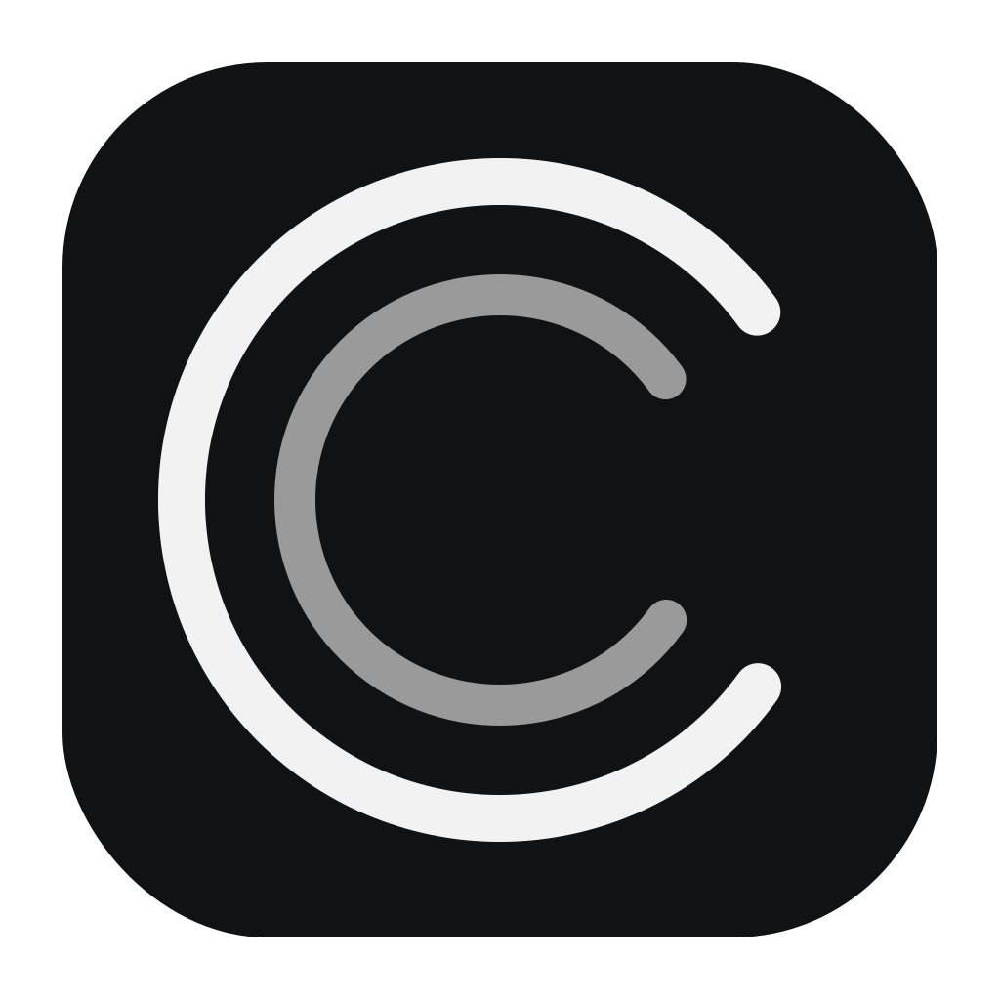

# Codex Usage App

<p align="center">
  
</p>

An unofficial, open-source macOS menu bar utility that shows the remaining
Codex 5-hour and weekly usage limits.

[日本語 README](README.ja.md)


## What it does

- Shows `5h` and weekly (`W`) remaining percentages in the menu bar.
- Displays used percentage, reset time, plan, and last update time.
- Refreshes automatically every two minutes.
- Supports launching at login through macOS `SMAppService`.
- Keeps usage data local; there is no analytics or developer-operated backend.

## Requirements

- macOS 13 or later.
- Apple Silicon or Intel Mac.
- One of the following installed and signed in:
  - ChatGPT/Codex desktop app, or
  - Codex CLI.

The app talks to the local [Codex App Server](https://learn.chatgpt.com/docs/app-server)
and calls the documented `account/rateLimits/read` method. It never reads or
stores your ChatGPT tokens itself.

## Install a release

1. Download `Codex-Usage-App.dmg` from the repository's Releases page.
2. Open the DMG, then open `Codex Usage.app`.
3. Click **Move and Open** when the app asks to move itself to `/Applications`.
4. If macOS blocks an unsigned community build, Control-click the app in Finder
   and choose **Open** once.
5. Optionally enable **Launch at Login** from the menu.

Community release builds are ad-hoc signed, not Apple-notarized.

## Build from source

Xcode is not required; the Swift toolchain included with Xcode Command Line
Tools is sufficient.

```bash
git clone https://github.com/estay-inc/codex-usage-app.git
cd codex-usage-app
./scripts/build.sh
open "build/Codex Usage.app"
```

Create a universal binary and ZIP package:

```bash
ARCHS=universal PACKAGE=1 ./scripts/build.sh
```

Create the DMG used for GitHub Releases:

```bash
ARCHS=universal DMG=1 ./scripts/build.sh
```

Run the live usage test on a Mac already signed in to Codex:

```bash
CODEX_USAGE_LIVE_TEST=1 ./scripts/test.sh
```

If Codex is installed in a custom location, set `CODEX_PATH` to the absolute
path of the executable before launching the app.

## Privacy

See [PRIVACY.md](PRIVACY.md). Usage values are held only in memory. The app
starts the locally installed Codex App Server, which communicates with OpenAI
under the user's existing account and OpenAI terms.

## Contributing

Issues and pull requests are welcome. See [CONTRIBUTING.md](CONTRIBUTING.md)
and [SECURITY.md](SECURITY.md).

## License and trademark notice

The source code in this repository is licensed under the [MIT License](LICENSE).

This project is unofficial and is not affiliated with, endorsed by, or
sponsored by OpenAI. Codex, ChatGPT, OpenAI, and related marks are trademarks of
OpenAI. This project does not include OpenAI logos or bundle OpenAI software.
Codex itself is available separately from OpenAI under the
[Apache-2.0 License](https://github.com/openai/codex).
